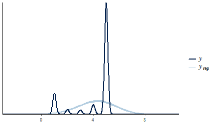
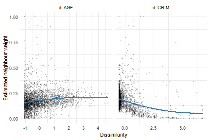
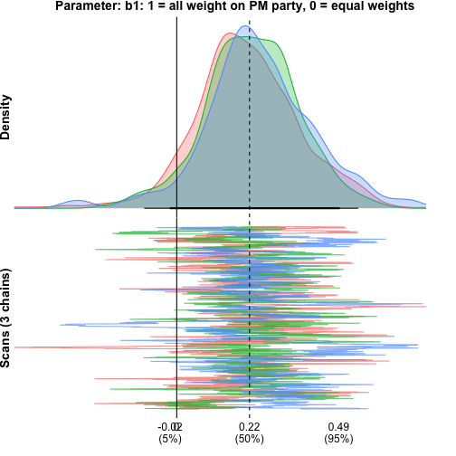
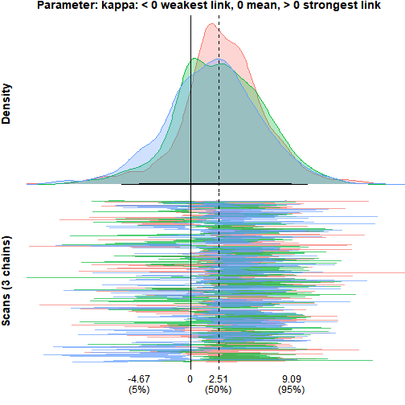

<a id="top"></a>

This vignette presents seven examples that show how the multiple-membership multilevel model (MMMM) can be applied to network, spatial, and aggregation problems.
The first three cover the additive micro-macro link: peer influence in a friendship network, neighbourhood effects on home values, and how coalition parties shape government survival.
The last four continue the coalition example to showcase aggregation beyond the weighted mean: distributional features (`fn("var")`), estimating the aggregation function itself (`fn("smax", kappa = est())`), cross-level interactions through named blocks, and heterogeneous member effects (`re(1 + x)`).

# 1. All friends, or just your best friend? (network regression)

The core question in this example is how peer influence adds up across a friendship group, using smoking as the behaviour of interest.

The data are the CILS4EU Germany Wave 1 friendship network, which covers classroom-level friendships in German secondary schools.
Students nominated up to five friends and ranked them by closeness (1 = best friend, 5 = fifth-closest).
Wave 2 smoking is predicted from Wave 1 friends' smoking; the one-year lag ensures a student's future behaviour cannot have caused her current friends' behaviour.


The model uses the following variables:

| Variable        | Role      | Meaning                                                   |
|-----------------|-----------|-----------------------------------------------------------|
| `ego`           | id        | Focal student (the group in the mm structure)             |
| `alter`         | id        | Nominated friend (the member)                             |
| `smoking_w2`    | outcome   | Ego's Wave 2 smoking, one year later                      |
| `smoking_ego`   | predictor | Ego's own Wave 1 smoking                                  |
| `gender_ego`    | predictor | Ego's gender                                              |
| `smoking_alter` | predictor | Friend's Wave 1 smoking (aggregated across friends)       |
| `rank`          | weight    | Friendship closeness (1 = best friend, 5 = fifth-closest) |
| `n`             | weight    | Number of friends nominated by the ego                    |

Two models are fit and compared.
The economics standard for this kind of network problem is the linear-in-means model: every friend carries equal weight, so what matters is the average across all of them, implying that each friend exerts the same influence.
The alternative is that influence is concentrated: a single close friend drives most of the effect while looser ties matter little.
`bml` fits both and compares them directly, changing only one line of the weight function.

## Model 1: linear-in-means

Every friend receives equal weight, `w ~ 1/n`, so the peer term is the simple average of all nominated friends' Wave 1 smoking.


``` r
mod_lim <-
  bml(
    smoking_w2 ~ smoking_ego + gender_ego +     # outcome ~ ego-level predictors
      mm(                                        # multiple-membership term (the peers)
        id   = id(alter, ego),                   # member = alter (friend), group = ego
        vars = vars(smoking_alter),              # member variable to aggregate
        w    = w(~ 1/n, scale = TRUE),           # equal weights, renormalised to sum to 1
        fn   = fn("sum"),                        # aggregation function: the weighted mean
        RE   = TRUE                              # member-level random effect
      ),
    family = gaussian(),                         # continuous outcome
    data   = cils_long
  )
```


## Model 2: best friend only

Only the closest-ranked friend contributes; all others are dropped.
`rank == min(rank)` evaluates to `TRUE` for the closest-ranked friend within each ego's friend set (rank 1), placing all weight on that friend.
With `scale = TRUE` the weight is renormalised to 1 within each ego, so the peer term becomes that single friend's smoking.


``` r
mod_bf <-
  bml(
    smoking_w2 ~ smoking_ego + gender_ego +
      mm(
        id   = id(alter, ego),
        vars = vars(smoking_alter),
        w    = w(~ rank == min(rank), scale = TRUE),  # all weight on the closest friend
        fn   = fn("sum"),                             # same aggregation function as Model 1
        RE   = TRUE
      ),
    family = gaussian(),
    data   = cils_long
  )
```


## Comparing the two models

`bmlCompare()` lays out the coefficient estimates and fit statistics of several models side by side, one column per model, with readable labels supplied through `labels`.


``` r
bmlCompare(
  "Linear-in-means"  = mod_lim,
  "Best friend only" = mod_bf,
  terms  = c("(Intercept)", "smoking_ego", "gender_ego", "A_smoking_alter"),
  labels = c("Intercept", "Own smoking (W1)", "Gender", "Peers' smoking (W1)")
)
```


|Term                |Linear-in-means       |Best friend only      |
|:-------------------|:---------------------|:---------------------|
|Intercept           |2.556 (2.345, 2.770)  |2.623 (2.448, 2.793)  |
|Own smoking (W1)    |0.365 (0.337, 0.390)  |0.360 (0.334, 0.386)  |
|Gender              |0.047 (-0.042, 0.133) |0.059 (-0.025, 0.144) |
|Peers' smoking (W1) |0.042 (0.001, 0.084)  |0.026 (-0.000, 0.052) |
|N                   |4002                  |4002                  |
|DIC                 |17029                 |18463                 |

Both models find a positive peer effect: students whose friends smoke more tend to smoke more themselves one year later, over and above their own Wave 1 smoking.
The own-smoking coefficient (about 0.36 in both models) dominates, which is expected since past behaviour is the strongest predictor of future behaviour.

The peer effect is present but modest.
Under linear-in-means, averaging across all nominated friends gives a coefficient of about 0.04 (CI [0.00, 0.08]), which just clears zero.
Limiting to the best friend gives about 0.03 (CI [-0.00, 0.05]): a smaller point estimate with a tighter interval that now just touches zero.

On fit, the linear-in-means model is clearly preferred (DIC 17,029 vs 18,463, a gap of over 1,400).
Peer influence on smoking appears to be spread across the friend set rather than concentrated in the single closest tie.

## Cross-validation: which aggregation does the data prefer?

DIC is convenient but crude; PSIS-LOO cross-validation compares the models on their out-of-sample predictive density.
For gaussian outcomes `bml` monitors the pointwise log-likelihood in the generated JAGS model, so `loo()` works directly on the fitted objects, and `loo::loo_compare()` ranks them:


``` r
loo_lim <- loo(mod_lim)
loo_bf  <- loo(mod_bf)
loo::loo_compare(loo_lim, loo_bf)
```


```
#>        elpd_diff se_diff
#> model1   0.0       0.0  
#> model2 -37.1       9.8
```

The linear-in-means model comes out on top: the best-friend model loses about 37 points of expected log predictive density (standard error about 10), agreeing with the DIC ranking.
Both criteria point the same way — influence is spread over the whole friend set rather than concentrated in the closest tie.

A posterior predictive check makes sure the preferred model reproduces the shape of the outcome at all.
`pp_check()` overlays replicated outcome distributions on the observed one:


``` r
pp_check(mod_lim)
```



The replicated densities track the observed distribution's spread and skew; the discreteness of the smoking scale shows up as bumps the gaussian model smooths over, which is worth knowing but does not affect the aggregation comparison.

[↑ Back to top](#top)

# 2. Air quality and home values (spatial regression)

This **spatial** example is based on [Harrison & Rubinfeld (1978)](https://www.sciencedirect.com/science/article/abs/pii/0095069678900062), who study the effect of air quality on home values, and the re-analysis by [Bivand (2017)](https://openjournals.wu.ac.at/region/paper_107/107.html).

The first example asked how a person's friends combine to influence them.
This example asks the spatial version of the same aggregation question: how do the surrounding tracts combine to shape a neighbourhood's home values?

The 1970 Boston census tract data are used, treating each tract's outcome as a function of its own attributes and those of its neighbours.
The question added to the classical approach is whether every neighbour should count equally, or whether tracts weigh their neighbours by how similar they are.

## Data and spatial weights


The data are the 1970 Boston Standard Metropolitan Statistical Area census tracts shipped with `spData`.
After dropping tracts with no housing and tracts that are entirely institutional, 506 tracts remain.
Each tract records its median home value, the local nitric-oxides concentration (the air-quality measure), and a handful of standard housing and demographic covariates.

The outcome is `lnCMEDV`, the log of median home value, which tames the skew in raw prices; every covariate is standardised so the coefficients are directly comparable.
The variables of interest are:

| Variable  | Role      | Meaning                                              |
|-----------|-----------|------------------------------------------------------|
| `tid`     | id        | Tract id (1 to 506)                                  |
| `lnCMEDV` | outcome   | Log median home value, the quantity modelled         |
| `NOX`     | predictor | Nitric-oxides concentration, the air-quality measure |
| `CRIM`    | predictor | Per-capita crime rate                                |
| `RM`      | predictor | Average rooms per dwelling                           |
| `DIS`     | predictor | Weighted distance to Boston employment centres       |
| `AGE`     | predictor | Share of units built before 1940                     |

## Baseline bml: equal weights

The baseline uses `w ~ 1/n`, giving every neighbour equal weight.
This is the conventional MMMM: the membership structure is present and variable weights are permitted, but here the weights are fixed.


``` r
mod_bml <-
  bml(
    lnCMEDV ~ NOX + CRIM + RM + DIS + AGE +      # outcome ~ own-tract covariates
      mm(
        id   = id(tid_nb, tid),                  # member = neighbour tract, group = focal tract
        vars = vars(NOX_nb + CRIM_nb + RM_nb + DIS_nb + AGE_nb),  # neighbour covariates to aggregate
        w    = w(~ 1/n, scale = TRUE),           # equal weights, normalised to sum to 1
        fn   = fn("sum"),                        # aggregation function: the weighted mean
        RE   = TRUE                              # neighbour-level random effect
      ),
    family = gaussian(),
    data   = boston_df
  )
```


## Parameterised weights: similarity across covariates

Equal weighting assumes every neighbour matters the same regardless of how similar it is to the focal tract.
A natural alternative is that tracts are more strongly influenced by neighbours that resemble them, a spatial homophily effect.
Rather than collapse similarity into a single number, the weight is allowed to depend on the dissimilarity in each covariate separately, using the functional form from Rosche (2026):

$$
w_{ij} = \frac{1}{1 + (n_i - 1)\exp\!\bigl(-(b_0 + b_1 \cdot d^{\text{CRIM}}_{ij} + b_2 \cdot d^{\text{AGE}}_{ij})\bigr)}
$$

Each `d` is the standardised absolute difference between a focal tract and its neighbour on that covariate.
When all the `b`'s are zero this collapses to `1/n_i`, the equal-weight baseline.
A negative coefficient means neighbours that are similar on that covariate (low `d`) receive more weight; a positive coefficient means dissimilar neighbours dominate.
Letting the two dissimilarities enter on their own lets the model decide which kind of similarity drives the aggregation, instead of imposing a single combined measure.


``` r
mod_bml_w <-
  bml(
    lnCMEDV ~ NOX + CRIM + RM + DIS + AGE +
      mm(
        id   = id(tid_nb, tid),
        vars = vars(NOX_nb + CRIM_nb + RM_nb + DIS_nb + AGE_nb),
        # weight as a function of covariate dissimilarity; nests 1/n when all b's are 0
        w    = w(~ 1 / (1 + (n - 1) * exp(-(b0 + b1 * d_CRIM + b2 * d_AGE))), scale = TRUE),
        fn   = fn("sum"),
        RE   = TRUE
      ),
    family = gaussian(),
    prior  = prior(normal(0, 1), class = "w"),   # weakly informative; prevents exp() overflow
    data   = boston_df2
  )
```


The estimated weight-function parameters are:


``` r
bmlCompare(
  "Similarity weights" = mod_bml_w,
  component = "weights",
  terms  = c("w[b0] (mm.1)", "w[b1] (mm.1)", "w[b2] (mm.1)"),
  labels = c("Weight intercept (b0)", "Crime dissimilarity (b1)", "Age dissimilarity (b2)")
)
```


|Term                     |Similarity weights      |
|:------------------------|:-----------------------|
|Weight intercept (b0)    |1.561 (-0.282, 2.787)   |
|Crime dissimilarity (b1) |-1.758 (-2.588, -1.165) |
|Age dissimilarity (b2)   |0.713 (0.074, 1.523)    |
|N                        |506                     |
|DIC                      |295                     |

The crime-dissimilarity coefficient is about −1.76 (CI [−2.59, −1.16]), clearly negative, so neighbours with similar crime levels carry more weight.
The age-dissimilarity coefficient is about 0.71 (CI [0.07, 1.52]), pointing the other way: neighbours with different age profiles carry more weight.
The model picks up two kinds of similarity at once, in opposite directions.

## Do the weights actually vary with similarity?

A direct check plots the estimated weight each neighbour received against the dissimilarity between that neighbour and its focal tract.
If crime homophily drives the weights, low-`d_CRIM` pairs should cluster toward high weights and high-`d_CRIM` pairs toward low weights.



The two panels show the similarity effects acting in opposite directions.
The weight falls as crime dissimilarity rises (the homophily the negative crime coefficient pointed to), while it rises gently with age dissimilarity, matching the positive age coefficient.
Each panel holds only a partial view, since every neighbour's weight reflects both dissimilarities at once, but the opposing slopes are visible.

## Benchmark: spatial Durbin error model

The classical spatial benchmark is the SDEM, which models a tract's outcome as a function of its own covariates, its neighbours' covariates, and a spatially correlated error.
It fits in seconds (no MCMC) and serves as a yardstick for the bml models.


``` r
mod_sdem <- errorsarlm(
  lnCMEDV ~ NOX + CRIM + RM + DIS + AGE,
  data   = boston,
  listw  = boston_wlist,
  Durbin = ~ NOX + CRIM + RM + DIS + AGE   # include neighbour-covariate effects (WX)
)
```

## Model comparison

The two bml models and the SDEM benchmark are placed in one table.
The SDEM's neighbour-covariate (`lag.`) terms are matched to the bml neighbour effects, and all rows are given readable labels.


|Term                     |Equal weights (1/n)     |Similarity weights      |SDEM (benchmark)        |
|:------------------------|:-----------------------|:-----------------------|:-----------------------|
|Intercept                |3.033 (2.997, 3.070)    |3.022 (2.987, 3.057)    |3.015 (2.950, 3.080)    |
|Air quality (NOX)        |-0.106 (-0.161, -0.048) |-0.075 (-0.131, -0.015) |-0.112 (-0.160, -0.064) |
|Crime                    |-0.061 (-0.082, -0.041) |-0.055 (-0.080, -0.030) |-0.067 (-0.086, -0.047) |
|Rooms                    |0.157 (0.137, 0.177)    |0.165 (0.147, 0.182)    |0.169 (0.150, 0.187)    |
|Distance to employment   |-0.096 (-0.208, 0.015)  |-0.071 (-0.164, 0.027)  |-0.086 (-0.169, -0.003) |
|Pre-1940 share           |-0.095 (-0.129, -0.062) |-0.103 (-0.131, -0.075) |-0.088 (-0.118, -0.057) |
|Air quality (neighbours) |0.020 (-0.072, 0.111)   |-0.001 (-0.090, 0.085)  |0.012 (-0.076, 0.101)   |
|Crime (neighbours)       |-0.132 (-0.184, -0.082) |-0.143 (-0.212, -0.074) |-0.103 (-0.156, -0.050) |
|Rooms (neighbours)       |0.073 (0.025, 0.121)    |0.092 (0.049, 0.136)    |0.040 (-0.006, 0.085)   |
|Distance (neighbours)    |-0.012 (-0.145, 0.117)  |-0.026 (-0.144, 0.086)  |-0.038 (-0.148, 0.072)  |
|Pre-1940 (neighbours)    |0.007 (-0.066, 0.080)   |0.014 (-0.051, 0.079)   |-0.020 (-0.094, 0.055)  |
|Weight intercept (b0)    |—                       |1.561 (-0.282, 2.787)   |—                       |
|Crime dissimilarity (b1) |—                       |-1.758 (-2.588, -1.165) |—                       |
|Age dissimilarity (b2)   |—                       |0.713 (0.074, 1.523)    |—                       |

Model fit (the SDEM is a maximum-likelihood model and has no DIC, so only the two bml models are compared on fit):


|Model               | DIC|
|:-------------------|---:|
|Equal weights (1/n) | 278|
|Similarity weights  | 295|

The own and neighbour coefficients from the equal-weight bml model line up with the SDEM, the reassurance worth having: the bml baseline reproduces the classical benchmark.
If equal-weight neighbour effects were all that was needed, `errorsarlm` would serve, and it would be faster.
What the parameterised weight function adds is the aggregation itself as something to estimate, which the SDEM cannot do.
On fit, the equal-weight model keeps the lower DIC (278 vs 295): the similarity structure in the weights is real — both dissimilarity coefficients sit away from zero — but the added flexibility does not pay for itself in overall fit here. The SDEM, a maximum-likelihood model, has no DIC, so it serves only as a coefficient yardstick.

[↑ Back to top](#top)

# 3. Political parties and the survival of coalition governments (micro-macro regression)

The previous two examples asked how peers or neighbours combine to shape an outcome.
This example asks the same of coalition politics: how do the parties in a coalition combine to determine whether the government survives?
Each coalition government is composed of multiple parties, and each party brings its own features such as organisational traits, funding structure, and internal cohesion.
The MMMM question is not just whether party characteristics matter, but how they aggregate from the party level up to the government level, and which parties weigh more.

This example also keeps the MCMC control arguments (`iter`, `warmup`, `chains`, `seed`) visible in the calls, because convergence and posterior summaries are the focus of the final section.

## The data

The `coalgov` dataset ships with the package.
Each row is one party's participation in one government: 2,077 party-government pairs spanning 628 governments and 312 parties across 29 countries.


| Variable    | Level      | Meaning                                                             |
|-------------|------------|---------------------------------------------------------------------|
| `gid`       | id         | Government identifier (the group)                                   |
| `pid`       | id         | Party identifier (the member)                                       |
| `dur_wkb`   | outcome    | Government duration in days                                         |
| `event_wkb` | outcome    | 1 = government fell from conflict; 0 = still standing when observed |
| `majority`  | government | 1 = majority coalition, 0 = minority                                |
| `mwc`       | government | 1 = minimal winning coalition, 0 = oversized                        |
| `n`         | government | Number of parties in the coalition                                  |
| `finance`   | party      | Party's dependence on outside money rather than dues (standardised) |
| `prime`     | party      | TRUE if the party holds the prime ministership, FALSE otherwise     |

The outcome is the pair `(dur_wkb, event_wkb)`, the standard way survival data is recorded: a duration, plus a flag for whether the duration ended in the event of interest (the government falling) or was merely the last point at which the government was observed in office.

## Equal-weight baseline

Every party contributes equally to the coalition's financial profile.
This is the natural starting point, where each party is assumed to contribute equally to the outcome.


``` r
mod_eq <-
  bml(
    Surv(dur_wkb, event_wkb) ~ 1 + majority + mwc +   # survival outcome ~ government covariates
      mm(
        id   = id(pid, gid),                          # member = party, group = government
        vars = vars(finance),                         # party variable to aggregate
        w    = w(~ 1/n, scale = TRUE),                # equal weights
        fn   = fn("sum"),                             # aggregation function: the weighted mean
        RE   = TRUE                                   # party-level random effect
      ),
    family   = weibull(),                             # survival (duration) outcome
    monitor  = TRUE,                                  # store MCMC draws (needed for diagnostics/plots)
    iter   = 5000,                                  # iterations per chain
    warmup = 500,                                   # discard the first 500
    chains = 3,                                     # number of chains
    seed     = 1,                                     # reproducibility
    data     = coalgov
  )
```


The finance coefficient is negative and away from zero: coalitions whose parties depend more on outside money tend to fall sooner.
The coefficient is on the log-survival-time scale, so negative means shorter expected duration.

Before testing an alternative weighting scheme, it helps to see how much of the variation in government survival originates at the party level.


``` r
varDecomp(mod_eq)
```


Table: Variance decomposition (Weibull)

|Component       | sigma| sigma_sd|  ICC| ICC_sd|
|:---------------|-----:|--------:|----:|------:|
|Residual        |  0.83|     0.04| 0.63|   0.07|
|MM (sigma.mm.1) |  1.07|     0.17| 0.37|   0.07|

About 37% of the variance in government survival sits at the party level.
Governments that share parties are more similar to each other than governments that do not, beyond anything the covariates explain.
The multiple-membership structure is not just added complexity: more than a third of what drives coalition survival is carried by the parties themselves.

## Letting weights vary across parties

Equal weighting assumes a small junior partner shapes the coalition's financial profile exactly as much as the party holding the prime ministership.
That assumption can be replaced with an estimate: the weight function lets the PM party carry more or less weight, with the amount estimated from the data.

A mixing parameter dials between the PM's party and the other parties.
At `b1 = 1` all weight goes to the prime minister's party; at `b1 = 0` a baseline aggregation rule is recovered.
There are two natural baselines to blend against, and they ask different questions, so both are fit and compared.

## Prime minister's party against equal weights

$$
w_{ij} = b_1 \cdot \text{prime}_{ij} + (1 - b_1)\cdot \tfrac{1}{n_i}
$$

This first blend puts the PM party against equal weighting.
At `b1 = 1`, the PM party carries all the weight; at `b1 = 0` it is the `1/n` baseline, so the parameter measures how far the data pull away from equal weights toward the prime minister's party.


``` r
mod_pm_n <-
  bml(
    Surv(dur_wkb, event_wkb) ~ 1 + majority + mwc +
      mm(
        id   = id(pid, gid),
        vars = vars(finance),
        w    = w(~ b1 * prime + (1 - b1) * (1/n), scale = TRUE),  # blend PM party vs equal weights
        fn   = fn("sum"),
        RE   = TRUE
      ),
    family   = weibull(),
    prior    = prior(normal(0, 1), class = "w"),
    monitor  = TRUE,
    iter   = 5000,
    warmup = 500,
    chains = 3,
    seed     = 1,
    data     = coalgov
  )
```


The weight parameter `w[prime] (mm.1)` is about 0.23, with a 95% interval of [-0.10, 0.55].
The estimate is positive, so the data lean toward the prime minister's party carrying more weight than equal aggregation would assign it, but the interval includes zero, so equal weighting cannot be ruled out.
The finance effect is about -0.26 [-0.51, -0.03], close to the baseline's -0.31 and still clearly negative: the story that coalitions reliant on outside money fall sooner holds whether or not the PM party is up-weighted.

## Prime minister against seat share

$$
w_{ij} = b_1 \cdot \text{prime}_{ij} + (1 - b_1)\cdot \text{pseat}_{ij}
$$

This second blend puts the PM party against seat-share proportionality.
At `b1 = 0` weights track each party's seat share, so the parameter measures how far the data pull away from proportionality toward the prime minister's party.


``` r
mod_pm_p <-
  bml(
    Surv(dur_wkb, event_wkb) ~ 1 + majority + mwc +
      mm(
        id   = id(pid, gid),
        vars = vars(finance),
        w    = w(~ b1 * prime + (1 - b1) * pseat, scale = TRUE),  # blend PM party vs seat share
        fn   = fn("sum"),
        RE   = TRUE
      ),
    family   = weibull(),
    prior    = prior(normal(0, 1), class = "w"),
    monitor  = TRUE,
    iter   = 5000,
    warmup = 500,
    chains = 3,
    seed     = 1,
    data     = coalgov
  )
```


Here `w[prime] (mm.1)` is about 0.12 with a 95% interval of [-0.27, 0.54].
The estimate is again positive with the interval spanning zero.
The smaller point estimate and wider interval mean the pull toward the PM party is even weaker than in the first parameterisation.
The finance effect changes to about -0.22 [-0.45, 0.01], its interval now just touching zero.

## Comparing the models


``` r
bmlCompare(
  "Equal weights (1/n)" = mod_eq,
  "PM vs equal (1/n)"   = mod_pm_n,
  "PM vs seat share"    = mod_pm_p,
  terms  = c("A_finance", "w[prime] (mm.1)"),
  labels = c("Finance", "PM weight (b1)")
)
```


|Term           |Equal weights (1/n)     |PM vs equal (1/n)       |PM vs seat share       |
|:--------------|:-----------------------|:-----------------------|:----------------------|
|Finance        |-0.313 (-0.562, -0.064) |-0.263 (-0.508, -0.026) |-0.220 (-0.450, 0.010) |
|PM weight (b1) |—                       |0.229 (-0.098, 0.549)   |0.123 (-0.270, 0.542)  |
|N              |628                     |628                     |628                    |
|DIC            |3864                    |3868                    |3854                   |

Across both blends the weight parameter is positive but its interval includes zero, so the prime minister's party does not measurably outweigh its partners in shaping the coalition's financial profile, whether compared against equal weights or against seat share.
The finance effect weakens slightly across the table, from -0.31 at baseline to -0.26 and then -0.22, staying negative throughout except for the last blend's interval, which just touches zero.
On fit, the PM-vs-seat-share blend has the lowest DIC (3854 against the baseline's 3864), with PM-vs-equal-weights slightly above the baseline (3868).
The gaps are small, and they come from a parameter that cannot be distinguished from zero.

## MCMC diagnostics

All models were fit with `monitor = TRUE`, which stores the posterior draws so convergence can be checked.
The diagnostics below are for the PM-vs-equal-weights model; the other models behave the same way.

`mcmcDiag()` reports the standard convergence statistics for the chosen parameters:


``` r
mcmcDiag(mod_pm_n, parameters = c("b.w.1", "b.fn.1"))
```


|                                   |  b.w.1| b.fn.1|
|:----------------------------------|------:|------:|
|Gelman/Rubin convergence statistic |  1.014|  1.004|
|Geweke z-score                     |  0.323| -0.209|
|Heidelberger/Welch p-value         |  0.351|  0.301|
|Autocorrelation (lag 50)           | -0.032| -0.031|

The diagnostics are clean.
Both Gelman-Rubin statistics are about 1.0, well under the 1.1 threshold; the Geweke z-scores fall within the usual ±2 bounds, the Heidelberger-Welch p-values exceed 0.05, and lag-50 autocorrelation is negligible.
The chains converged, are stationary, and mixed well.

`monetPlot()` shows the posterior density (top) and the trace across iterations (bottom) for a single parameter — here the weight parameter `b1`:


``` r
monetPlot(mod_pm_n, "b.w.1", label = "b1: 1 = all weight on PM party, 0 = equal weights")
```



The posterior density is a single hump centred at about 0.23, just right of the zero line, with most of its mass to the right but a clear slice left of zero, so zero stays inside the 95% interval.
In the trace panel the three chains overlap and cover the same range with no separation — the visual counterpart to the clean diagnostics above.

## brms-style accessors

The standard post-estimation vocabulary works as it does in brms.
`fixef()` returns every class-`"b"` coefficient labeled by term, and `as_draws_df()` converts the stored chains to the **posterior** package's format, unlocking `summarise_draws()`, `rhat()`, and the rest of that toolchain:


``` r
fixef(mod_pm_n)
```

```
#>               Estimate Est.Error        Q2.5       Q97.5
#> (Intercept)  6.7998045 0.1472916  6.51399566  7.09723696
#> majority     0.2287003 0.1515294 -0.07048843  0.52734023
#> mwc          0.5017811 0.1445882  0.23663764  0.79669163
#> A_finance   -0.2629192 0.1250373 -0.50811416 -0.02572199
```


``` r
draws <- as_draws_df(mod_pm_n)
posterior::summarise_draws(posterior::subset_draws(draws, variable = "b.w.1"))
```

```
#> # A tibble: 1 × 10
#>   variable  mean median    sd   mad      q5   q95  rhat ess_bulk ess_tail
#>   <chr>    <dbl>  <dbl> <dbl> <dbl>   <dbl> <dbl> <dbl>    <dbl>    <dbl>
#> 1 b.w.1    0.229  0.224 0.158 0.140 -0.0210 0.493  1.01     149.     247.
```

[↑ Back to top](#top)

# 4. Does the average matter, or the spread? (emergent features)

The three examples so far all aggregated member attributes with a weighted *mean*: the additive micro-macro link.
But a coalition whose parties are uniformly moderate on some trait and a coalition mixing one extreme party with several counterbalancing ones can have the *same* mean.
If what breaks governments is internal contrast rather than the average level, the mean is silent about the mechanism.

`fn()` selects the aggregation function a block applies to the weighted member records.
`fn("sum")` (used in every example so far) produces the weighted mean `A_finance`; `fn("var")` produces the weighted variance `V_finance`, a feature of the whole set.
Blocks stack, so both features can enter one model, each with its own main-model coefficient:


``` r
mod_var <-
  bml(
    Surv(dur_wkb, event_wkb) ~ 1 + majority + mwc +
      mm(
        id   = id(pid, gid),
        vars = vars(finance),
        w    = w(~ 1/n, scale = TRUE),
        fn   = fn("sum"),
        RE   = TRUE                    # mean block keeps the party random effects
      ) +
      mm(
        id   = id(pid, gid),
        vars = vars(finance),
        w    = w(~ 1/n, scale = TRUE),
        fn   = fn("var")               # spread block: V_finance
      ),
    family   = weibull(),
    iter   = 5000,
    warmup = 500,
    chains = 3,
    seed     = 1,
    data     = coalgov
  )
```


``` r
bmlCompare(
  "Mean only"     = mod_eq,
  "Mean + spread" = mod_var,
  terms  = c("A_finance", "V_finance"),
  labels = c("Finance (mean)", "Finance (spread)")
)
```


|Term             |Mean only               |Mean + spread           |
|:----------------|:-----------------------|:-----------------------|
|Finance (mean)   |-0.313 (-0.562, -0.064) |-0.306 (-0.600, -0.006) |
|Finance (spread) |—                       |-0.015 (-0.268, 0.234)  |
|N                |628                     |628                     |
|DIC              |3864                    |3868                    |

The mean effect `A_finance` is essentially unchanged by adding the spread term (about -0.31 in both models), which is the first thing to check: the two features answer different questions rather than competing for the same variation.
The spread coefficient `V_finance` is about -0.02 with a 95% interval of [-0.27, 0.23] — a null.
For these data, what matters about a coalition's financial exposure is its level, not its internal contrast, and the DIC agrees (3864 for the mean-only model vs 3868 with the spread term).
A null on the spread is itself informative: it is the empirical license behind the mean-only models of Example 3, checked rather than assumed.

Both aggregation functions read the *same* weighted member records; only the reduction differs.
That is the sense in which the variance term is emergent: it is a property of the set that no single party's contribution can carry.

[↑ Back to top](#top)

# 5. What is the aggregation function? (estimating f itself)

Example 4 chose the candidate functions by hand and let the fit statistics adjudicate.
The smooth-max family goes one step further and makes the aggregation function itself the estimand.
`fn("smax", kappa)` computes

$$
\mathrm{smax}(x;\kappa) = \tfrac{1}{\kappa}\,\log \textstyle\sum_k w_k e^{\kappa x_k},
$$

which runs from the *minimum* of the member attributes (as $\kappa \to -\infty$) through the weighted *mean* (at $\kappa \to 0$) to the *maximum* (as $\kappa \to +\infty$).
With `kappa = est()` the data choose the point on that path: is government survival driven by the coalition's average financial exposure, by its least exposed party (weakest link), or by its most exposed one?


``` r
mod_smax <-
  bml(
    Surv(dur_wkb, event_wkb) ~ 1 + majority + mwc +
      mm(
        id   = id(pid, gid),
        vars = vars(finance),
        w    = w(~ 1/n, scale = TRUE),
        fn   = fn("smax", kappa = est())   # kappa < 0: min-like, kappa > 0: max-like
      ) +
      mm(
        id   = id(pid, gid),
        w    = w(~ 1/n, scale = TRUE),
        fn   = fn("sum"),
        RE   = TRUE                        # party random effects in their own block
      ),
    family   = weibull(),
    iter   = 5000,
    warmup = 500,
    chains = 3,
    seed     = 1,
    data     = coalgov
  )
```


Shape parameters like `kappa` are not coefficients: they are reported in their own component (`fn[...]`), never in the coefficient table, and take priors through `prior(..., class = "fn")`.
`get_prior()` lists what is settable.
The posterior of `kappa` answers the question directly:


``` r
monetPlot(mod_smax, "fn.kappa.1", label = "kappa: < 0 weakest link, 0 mean, > 0 strongest link")
```



The feature's coefficient is clearly negative (`smax_finance` about -0.24 [-0.52, -0.06]), so the exposure feature matters — but the posterior for `kappa` is centred near 2.5 with a 95% interval of roughly [-6, 11], spanning weakest-link through strongest-link readings.
Two things follow.
First, the caveat that belongs with this estimand: `kappa` reaches the outcome only through the feature, so it is identified only insofar as differently-shaped aggregates fit differently — and with small coalitions (most have two to four parties), the min, mean, and max of finance are highly correlated, so the likelihood is nearly flat in `kappa`.
Second, a diffuse posterior here is not a failure of the sampler; it is the honest statement that these data cannot pin down the aggregation function, which is exactly what making `f` an estimand is for.

[↑ Back to top](#top)

# 6. Does context change the aggregate's effect? (cross-level interaction)

Coalition majority status is a government-level (macro) attribute.
Because it is constant across the parties of a government, interacting it with the aggregated finance profile collapses to a product of two group-level quantities: a cross-level interaction.

In `bml` this is written by giving the block a `name` and referencing that name in the main formula.
The macro variable must also appear as a main effect:


``` r
mod_xl <-
  bml(
    Surv(dur_wkb, event_wkb) ~ 1 + majority + mwc + Afin:majority +
      mm(
        name = Afin,                      # named block: referencable feature
        id   = id(pid, gid),
        vars = vars(finance),
        w    = w(~ 1/n, scale = TRUE),
        fn   = fn("sum"),
        RE   = TRUE
      ),
    family   = weibull(),
    iter   = 5000,
    warmup = 500,
    chains = 3,
    seed     = 1,
    data     = coalgov
  )
```


``` r
fixef(mod_xl)
```

```
#>                 Estimate Est.Error        Q2.5     Q97.5
#> (Intercept)    6.8099757 0.1533719  6.51490635 7.1262164
#> majority       0.2362897 0.1603613 -0.08576551 0.5481584
#> mwc            0.4907232 0.1503586  0.19334021 0.7821277
#> Afin          -0.2281652 0.2198792 -0.65680427 0.2096516
#> Afin:majority -0.1072704 0.2371408 -0.57573029 0.3637120
```

The interaction row `Afin:majority` asks whether the financial-exposure penalty differs between majority and minority governments.
The estimate is about -0.11 [-0.58, 0.36]: no evidence that majority status moderates the exposure penalty.
The name refers to the block's *fixed* feature only — the interaction multiplies `majority` with the aggregate `A_finance`, not with the party random effects, which continue to enter additively.

[↑ Back to top](#top)

# 7. Heterogeneous member effects (explained and residual)

Everything so far assumed each party's finance trait carries the same effect.
Allowing the member effect to vary decomposes into two parts, and both fit in a single block:

- **Explained heterogeneity:** the effect differs by an observed member attribute — here, whether the party holds the prime ministership.
  That is the member-paired interaction `vars(finance:prime)`, aggregated as its own feature `H_finance_prime`.
- **Residual heterogeneity:** parties differ in ways no covariate captures — a random slope, `re(1 + finance)`, whose spread `sd(finance)` measures how much effect heterogeneity remains after the explained part.


``` r
mod_het <-
  bml(
    Surv(dur_wkb, event_wkb) ~ 1 + majority + mwc +
      mm(
        id   = id(pid, gid),
        vars = vars(finance + finance:prime),  # mean effect + explained heterogeneity
        w    = w(~ 1/n, scale = TRUE),
        fn   = fn("sum"),
        RE   = re(1 + finance)                 # random intercept + residual slope
      ),
    family   = weibull(),
    iter   = 5000,
    warmup = 500,
    chains = 3,
    seed     = 1,
    data     = coalgov
  )
```


``` r
tidy(mod_het) |>
  dplyr::filter(term %in% c("A_finance", "H_finance_prime",
                            "sd(Intercept) (mm.1)", "sd(finance) (mm.1)"))
```

```
#> # A tibble: 4 × 6
#>   term                 estimate std.error conf.low conf.high component
#>   <chr>                   <dbl>     <dbl>    <dbl>     <dbl> <chr>    
#> 1 A_finance              -0.403     0.184  -0.771    -0.0457 fixed    
#> 2 H_finance_prime         0.158     0.313  -0.440     0.738  fixed    
#> 3 sd(Intercept) (mm.1)    0.633     0.285   0.0784    1.12   random   
#> 4 sd(finance) (mm.1)      0.804     0.251   0.337     1.31   random
```

Three quantities carry the story.
`A_finance` is the average finance effect across parties.
`H_finance_prime` is the explained half of the heterogeneity: about 0.16 [-0.44, 0.74], so the PM party's financial exposure does not measurably carry a different effect than its partners' — consistent with the weight-function analysis in Example 3, which asked a related question through the weights instead of the effects.
`sd(finance)` is the residual half: about 0.80 [0.34, 1.31], substantial party-to-party variation in the finance effect that no observed attribute accounts for.
Random slopes default to being independent of the random intercepts; `re(1 + finance, cor = TRUE)` opts into the correlated version.

[↑ Back to top](#top)
