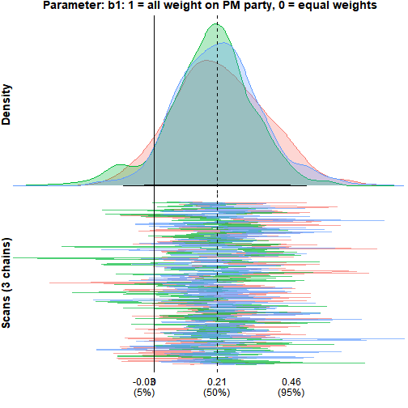

<style>
/* Float the table of contents on the right-hand side */
@media (min-width: 768px) {
  .main-container .row > div:first-child { width: 0 !important; padding: 0 !important; }
  .main-container .row > .toc-content {
    width: 100% !important;
    margin-left: 0 !important;
    padding-right: 23%;
  }
  #TOC.tocify { left: auto; right: 1.5%; margin-left: 0; }
}
</style>

This vignette presents three examples that show how the multiple-membership multilevel model (MMMM) can be applied to network, spatial, and aggregation problems: peer influence in a friendship network, neighbourhood effects on home values, and how coalition parties shape government survival.

# All friends, or just your best friend? (network regression)

The core question in this example is how peer influence adds up across a friendship group, using smoking as the behaviour of interest.

The data are the CILS4EU Germany Wave 1 friendship network, which covers classroom-level friendships in German secondary schools.
Students nominated up to five friends and ranked them by closeness (1 = best friend, 5 = fifth-closest).
Wave 2 smoking is predicted from Wave 1 friends' smoking; the one-year lag ensures a student's future behaviour cannot have caused her current friends' behaviour.


The model uses the following variables:

| Variable        | Role      | Meaning                                                   |
|-----------------|-----------|-----------------------------------------------------------|
| `ego`           | id        | Focal student (the group in the mm structure)             |
| `alter`         | id        | Nominated friend (the member)                             |
| `smoking_w2`    | outcome   | Ego's Wave 2 smoking, one year later                      |
| `smoking_ego`   | predictor | Ego's own Wave 1 smoking                                  |
| `gender_ego`    | predictor | Ego's gender                                              |
| `smoking_alter` | predictor | Friend's Wave 1 smoking (aggregated across friends)       |
| `rank`          | weight    | Friendship closeness (1 = best friend, 5 = fifth-closest) |
| `n`             | weight    | Number of friends nominated by the ego                    |

Two models are fit and compared.
The economics standard for this kind of network problem is the linear-in-means model: every friend carries equal weight, so what matters is the average across all of them, implying that each friend exerts the same influence.
The alternative is that influence is concentrated: a single close friend drives most of the effect while looser ties matter little.
`bml` fits both and compares them directly, changing only one line of the weight function.

## Model 1: linear-in-means

Every friend receives equal weight, `w ~ 1/n`, so the peer term is the simple average of all nominated friends' Wave 1 smoking.


``` r
mod_lim <-
  bml(
    smoking_w2 ~ smoking_ego + gender_ego +     # outcome ~ ego-level predictors
      mm(                                        # multiple-membership term (the peers)
        id   = id(alter, ego),                   # member = alter (friend), group = ego
        vars = vars(smoking_alter),              # member variable to aggregate
        fn   = fn(w ~ 1/n, c = TRUE),            # equal weights, renormalised to sum to 1
        RE   = TRUE                              # member-level random effect
      ),
    family = "Gaussian",                         # continuous outcome
    data   = cils_long
  )
```


## Model 2: best friend only

Only the closest-ranked friend contributes; all others are dropped.
`rank == min(rank)` evaluates to `TRUE` for the closest-ranked friend within each ego's friend set (rank 1), placing all weight on that friend.
With `c = TRUE` the weight is renormalised to 1 within each ego, so the peer term becomes that single friend's smoking.


``` r
mod_bf <-
  bml(
    smoking_w2 ~ smoking_ego + gender_ego +
      mm(
        id   = id(alter, ego),
        vars = vars(smoking_alter),
        fn   = fn(w ~ rank == min(rank), c = TRUE),  # all weight on the closest friend
        RE   = TRUE
      ),
    family = "Gaussian",
    data   = cils_long
  )
```


## Comparing the two models

`bmlCompare()` lays out the coefficient estimates and fit statistics of several models side by side, one column per model, with readable labels supplied through `labels`.


``` r
bmlCompare(
  "Linear-in-means"  = mod_lim,
  "Best friend only" = mod_bf,
  terms  = c("Intercept", "smoking_ego", "gender_ego", "smoking_alter (mm.1)"),
  labels = c("Intercept", "Own smoking (W1)", "Gender", "Peers' smoking (W1)")
)
```


|Term                |Linear-in-means       |Best friend only      |
|:-------------------|:---------------------|:---------------------|
|Intercept           |2.557 (2.336, 2.771)  |2.626 (2.449, 2.798)  |
|Own smoking (W1)    |0.365 (0.338, 0.391)  |0.358 (0.334, 0.383)  |
|Gender              |0.048 (-0.042, 0.134) |0.052 (-0.031, 0.137) |
|Peers' smoking (W1) |0.042 (0.001, 0.085)  |0.030 (0.005, 0.057)  |
|N                   |4002                  |4002                  |
|DIC                 |16866                 |15811                 |

Both models find a positive peer effect: students whose friends smoke more tend to smoke more themselves one year later, over and above their own Wave 1 smoking.
The own-smoking coefficient (about 0.36 in both models) dominates, which is expected since past behaviour is the strongest predictor of future behaviour.

The peer effect is present but modest.
Under linear-in-means, averaging across all nominated friends gives a coefficient of about 0.04 (CI [0.00, 0.08]), which just clears zero.
Limiting to the best friend gives about 0.03 (CI [0.005, 0.06]): a smaller point estimate but a tighter interval, because the best-friend model discards the noisier lower-ranked ties.

On fit, the best-friend model is clearly preferred (DIC 15,811 vs 16,866, a gap of over 1,000).
Focusing on the single closest friend describes how peer influence on smoking aggregates better than treating all friends as equally important.

# Air quality and home values (spatial regression)

This **spatial** example is based on [Harrison & Rubinfeld (1978)](https://www.sciencedirect.com/science/article/abs/pii/0095069678900062), who study the effect of air quality on home values, and the re-analysis by [Bivand (2017)](https://openjournals.wu.ac.at/region/paper_107/107.html).

The first example asked how a person's friends combine to influence them.
This example asks the spatial version of the same aggregation question: how do the surrounding tracts combine to shape a neighbourhood's home values?

The 1970 Boston census tract data are used, treating each tract's outcome as a function of its own attributes and those of its neighbours.
The question added to the classical approach is whether every neighbour should count equally, or whether tracts weigh their neighbours by how similar they are.

## Data and spatial weights


The data are the 1970 Boston Standard Metropolitan Statistical Area census tracts shipped with `spData`.
After dropping tracts with no housing and tracts that are entirely institutional, 506 tracts remain.
Each tract records its median home value, the local nitric-oxides concentration (the air-quality measure), and a handful of standard housing and demographic covariates.

The outcome is `lnCMEDV`, the log of median home value, which tames the skew in raw prices; every covariate is standardised so the coefficients are directly comparable.
The variables of interest are:

| Variable  | Role      | Meaning                                              |
|-----------|-----------|------------------------------------------------------|
| `tid`     | id        | Tract id (1 to 506)                                  |
| `lnCMEDV` | outcome   | Log median home value, the quantity modelled         |
| `NOX`     | predictor | Nitric-oxides concentration, the air-quality measure |
| `CRIM`    | predictor | Per-capita crime rate                                |
| `RM`      | predictor | Average rooms per dwelling                           |
| `DIS`     | predictor | Weighted distance to Boston employment centres       |
| `AGE`     | predictor | Share of units built before 1940                     |

## Baseline bml: equal weights

The baseline uses `w ~ 1/n`, giving every neighbour equal weight.
This is the conventional MMMM: the membership structure is present and variable weights are permitted, but here the weights are fixed.


``` r
mod_bml <-
  bml(
    lnCMEDV ~ NOX + CRIM + RM + DIS + AGE +      # outcome ~ own-tract covariates
      mm(
        id   = id(tid_nb, tid),                  # member = neighbour tract, group = focal tract
        vars = vars(NOX_nb + CRIM_nb + RM_nb + DIS_nb + AGE_nb),  # neighbour covariates to aggregate
        fn   = fn(w ~ 1/n, c = TRUE),            # equal weights, normalised to sum to 1
        RE   = TRUE                              # neighbour-level random effect
      ),
    family = "Gaussian",
    data   = boston_df
  )
```


## Parameterised weights: similarity across covariates

Equal weighting assumes every neighbour matters the same regardless of how similar it is to the focal tract.
A natural alternative is that tracts are more strongly influenced by neighbours that resemble them, a spatial homophily effect.
Rather than collapse similarity into a single number, the weight is allowed to depend on the dissimilarity in each covariate separately, using the functional form from Rosche (2026):

$$
w_{ij} = \frac{1}{1 + (n_i - 1)\exp\!\bigl(-(b_0 + b_1 \cdot d^{\text{CRIM}}_{ij} + b_2 \cdot d^{\text{AGE}}_{ij})\bigr)}
$$

Each `d` is the standardised absolute difference between a focal tract and its neighbour on that covariate.
When all the `b`'s are zero this collapses to `1/n_i`, the equal-weight baseline.
A negative coefficient means neighbours that are similar on that covariate (low `d`) receive more weight; a positive coefficient means dissimilar neighbours dominate.
Letting the two dissimilarities enter on their own lets the model decide which kind of similarity drives the aggregation, instead of imposing a single combined measure.


``` r
mod_bml_w <-
  bml(
    lnCMEDV ~ NOX + CRIM + RM + DIS + AGE +
      mm(
        id   = id(tid_nb, tid),
        vars = vars(NOX_nb + CRIM_nb + RM_nb + DIS_nb + AGE_nb),
        # weight as a function of covariate dissimilarity; nests 1/n when all b's are 0
        fn   = fn(w ~ 1 / (1 + (n - 1) * exp(-(b0 + b1 * d_CRIM + b2 * d_AGE))), c = TRUE),
        RE   = TRUE
      ),
    family = "Gaussian",
    priors = list("b.w.1 ~ dnorm(0, 1)"),        # weakly informative; prevents exp() overflow
    data   = boston_df2
  )
```


The estimated weight-function parameters are:


``` r
bmlCompare(
  "Similarity weights" = mod_bml_w,
  component = "weights",
  terms  = c("X0 (w.1)", "d_CRIM (w.1)", "d_AGE (w.1)"),
  labels = c("Weight intercept (b0)", "Crime dissimilarity", "Age dissimilarity")
)
```


|Term                  |Similarity weights      |
|:---------------------|:-----------------------|
|Weight intercept (b0) |1.594 (-0.046, 2.804)   |
|Crime dissimilarity   |-1.784 (-2.543, -1.178) |
|Age dissimilarity     |0.728 (0.098, 1.528)    |
|N                     |506                     |
|DIC                   |299                     |

The crime-dissimilarity coefficient is about −1.78 (CI [−2.54, −1.18]), clearly negative, so neighbours with similar crime levels carry more weight.
The age-dissimilarity coefficient is about 0.73 (CI [0.10, 1.53]), pointing the other way: neighbours with different age profiles carry more weight.
The model picks up two kinds of similarity at once, in opposite directions.

## Do the weights actually vary with similarity?

A direct check plots the estimated weight each neighbour received against the dissimilarity between that neighbour and its focal tract.
If crime homophily drives the weights, low-`d_CRIM` pairs should cluster toward high weights and high-`d_CRIM` pairs toward low weights.


The two panels show the similarity effects acting in opposite directions.
The weight falls as crime dissimilarity rises (the homophily the negative crime coefficient pointed to), while it rises gently with age dissimilarity, matching the positive age coefficient.
Each panel holds only a partial view, since every neighbour's weight reflects both dissimilarities at once, but the opposing slopes are visible.

## Benchmark: spatial Durbin error model

The classical spatial benchmark is the SDEM, which models a tract's outcome as a function of its own covariates, its neighbours' covariates, and a spatially correlated error.
It fits in seconds (no MCMC) and serves as a yardstick for the bml models.


``` r
mod_sdem <- errorsarlm(
  lnCMEDV ~ NOX + CRIM + RM + DIS + AGE,
  data   = boston,
  listw  = boston_wlist,
  Durbin = ~ NOX + CRIM + RM + DIS + AGE   # include neighbour-covariate effects (WX)
)
```

## Model comparison

The two bml models and the SDEM benchmark are placed in one table.
The SDEM's neighbour-covariate (`lag.`) terms are matched to the bml neighbour effects, and all rows are given readable labels.


|Term                     |Equal weights (1/n)     |Similarity weights      |SDEM (benchmark)        |
|:------------------------|:-----------------------|:-----------------------|:-----------------------|
|Intercept                |3.033 (2.997, 3.069)    |3.022 (2.985, 3.057)    |3.015 (2.950, 3.080)    |
|Air quality (NOX)        |-0.106 (-0.162, -0.048) |-0.075 (-0.134, -0.015) |-0.112 (-0.160, -0.064) |
|Crime                    |-0.061 (-0.082, -0.040) |-0.054 (-0.079, -0.030) |-0.067 (-0.086, -0.047) |
|Rooms                    |0.158 (0.138, 0.177)    |0.165 (0.148, 0.183)    |0.169 (0.150, 0.187)    |
|Distance to employment   |-0.097 (-0.203, 0.015)  |-0.069 (-0.165, 0.024)  |-0.086 (-0.169, -0.003) |
|Pre-1940 share           |-0.095 (-0.130, -0.062) |-0.101 (-0.130, -0.074) |-0.088 (-0.118, -0.057) |
|Air quality (neighbours) |0.018 (-0.071, 0.111)   |-0.002 (-0.089, 0.085)  |0.012 (-0.076, 0.101)   |
|Crime (neighbours)       |-0.132 (-0.183, -0.080) |-0.144 (-0.217, -0.074) |-0.103 (-0.156, -0.050) |
|Rooms (neighbours)       |0.072 (0.023, 0.119)    |0.092 (0.047, 0.135)    |0.040 (-0.006, 0.085)   |
|Distance (neighbours)    |-0.013 (-0.143, 0.115)  |-0.028 (-0.140, 0.088)  |-0.038 (-0.148, 0.072)  |
|Pre-1940 (neighbours)    |0.007 (-0.069, 0.079)   |0.013 (-0.052, 0.079)   |-0.020 (-0.094, 0.055)  |
|Weight intercept (b0)    |—                       |1.594 (-0.046, 2.804)   |—                       |
|Crime dissimilarity      |—                       |-1.784 (-2.543, -1.178) |—                       |
|Age dissimilarity        |—                       |0.728 (0.098, 1.528)    |—                       |

Model fit (the SDEM is a maximum-likelihood model and has no DIC, so only the two bml models are compared on fit):


|Model               | DIC|
|:-------------------|---:|
|Equal weights (1/n) | 308|
|Similarity weights  | 299|

The own and neighbour coefficients from the equal-weight bml model line up with the SDEM, the reassurance worth having: the bml baseline reproduces the classical benchmark.
If equal-weight neighbour effects were all that was needed, `errorsarlm` would serve, and it would be faster.
What the parameterised weight function adds is the aggregation itself as something to estimate, which the SDEM cannot do.
On fit, the similarity-weighted model improves on equal weighting (DIC 299 vs 308). The SDEM, a maximum-likelihood model, has no DIC, so it serves only as a coefficient yardstick.

# Political parties and the survival of coalition governments (micro-macro regression)

The previous two examples asked how peers or neighbours combine to shape an outcome.
This example asks the same of coalition politics: how do the parties in a coalition combine to determine whether the government survives?
Each coalition government is composed of multiple parties, and each party brings its own features such as organisational traits, funding structure, and internal cohesion.
The MMMM question is not just whether party characteristics matter, but how they aggregate from the party level up to the government level, and which parties weigh more.

This example also keeps the MCMC control arguments (`n.iter`, `n.burnin`, `n.chains`, `seed`) visible in the calls, because convergence and posterior summaries are the focus of the final section.

## The data

The `coalgov` dataset ships with the package.
Each row is one party's participation in one government: 2,077 party-government pairs spanning 628 governments and 312 parties across 29 countries.


| Variable    | Level      | Meaning                                                             |
|-------------|------------|---------------------------------------------------------------------|
| `gid`       | id         | Government identifier (the group)                                   |
| `pid`       | id         | Party identifier (the member)                                       |
| `dur_wkb`   | outcome    | Government duration in days                                         |
| `event_wkb` | outcome    | 1 = government fell from conflict; 0 = still standing when observed |
| `majority`  | government | 1 = majority coalition, 0 = minority                                |
| `mwc`       | government | 1 = minimal winning coalition, 0 = oversized                        |
| `n`         | government | Number of parties in the coalition                                  |
| `finance`   | party      | Party's dependence on outside money rather than dues (standardised) |
| `prime`     | party      | TRUE if the party holds the prime ministership, FALSE otherwise     |

The outcome is the pair `(dur_wkb, event_wkb)`, the standard way survival data is recorded: a duration, plus a flag for whether the duration ended in the event of interest (the government falling) or was merely the last point at which the government was observed in office.

## Equal-weight baseline

Every party contributes equally to the coalition's financial profile.
This is the natural starting point, where each party is assumed to contribute equally to the outcome.


``` r
mod_eq <-
  bml(
    Surv(dur_wkb, event_wkb) ~ 1 + majority + mwc +   # survival outcome ~ government covariates
      mm(
        id   = id(pid, gid),                          # member = party, group = government
        vars = vars(finance),                         # party variable to aggregate
        fn   = fn(w ~ 1/n, c = TRUE),                 # equal weights
        RE   = TRUE                                   # party-level random effect
      ),
    family   = "Weibull",                             # survival (duration) outcome
    monitor  = TRUE,                                  # store MCMC draws (needed for diagnostics/plots)
    n.iter   = 5000,                                  # iterations per chain
    n.burnin = 500,                                   # discard the first 500
    n.chains = 3,                                     # number of chains
    seed     = 1,                                     # reproducibility
    data     = coalgov
  )
```


The finance coefficient is negative and away from zero: coalitions whose parties depend more on outside money tend to fall sooner.
The coefficient is on the log-survival-time scale, so negative means shorter expected duration.

Before testing an alternative weighting scheme, it helps to see how much of the variation in government survival originates at the party level.


``` r
varDecomp(mod_eq)
```


Table: Variance decomposition (Weibull)

|Component       | sigma| sigma_sd|  ICC| ICC_sd|
|:---------------|-----:|--------:|----:|------:|
|Residual        |  0.83|     0.05| 0.63|   0.07|
|MM (sigma.mm.1) |  1.08|     0.16| 0.37|   0.07|

About 37% of the variance in government survival sits at the party level.
Governments that share parties are more similar to each other than governments that do not, beyond anything the covariates explain.
The multiple-membership structure is not just added complexity: more than a third of what drives coalition survival is carried by the parties themselves.

## Letting weights vary across parties

Equal weighting assumes a small junior partner shapes the coalition's financial profile exactly as much as the party holding the prime ministership.
That assumption can be replaced with an estimate: the weight function lets the PM party carry more or less weight, with the amount estimated from the data.

A mixing parameter dials between the PM's party and the other parties.
At `b1 = 1` all weight goes to the prime minister's party; at `b1 = 0` a baseline aggregation rule is recovered.
There are two natural baselines to blend against, and they ask different questions, so both are fit and compared.

## Prime minister's party against equal weights

$$
w_{ij} = b_1 \cdot \text{prime}_{ij} + (1 - b_1)\cdot \tfrac{1}{n_i}
$$

This first blend puts the PM party against equal weighting.
At `b1 = 1`, the PM party carries all the weight; at `b1 = 0` it is the `1/n` baseline, so the parameter measures how far the data pull away from equal weights toward the prime minister's party.


``` r
mod_pm_n <-
  bml(
    Surv(dur_wkb, event_wkb) ~ 1 + majority + mwc +
      mm(
        id   = id(pid, gid),
        vars = vars(finance),
        fn   = fn(w ~ b1 * prime + (1 - b1) * (1/n), c = TRUE),  # blend PM party vs equal weights
        RE   = TRUE
      ),
    family   = "Weibull",
    priors   = list("b.w.1 ~ dnorm(0, 1)"),
    monitor  = TRUE,
    n.iter   = 5000,
    n.burnin = 500,
    n.chains = 3,
    seed     = 1,
    data     = coalgov
  )
```


The weight parameter `prime (w.1)` is about 0.21, with a 95% interval of [-0.10, 0.52].
The estimate is positive, so the data lean toward the prime minister's party carrying more weight than equal aggregation would assign it, but the interval includes zero, so equal weighting cannot be ruled out.
The finance effect is about -0.27 [-0.52, -0.03], close to the baseline's -0.32 and still clearly negative: the story that coalitions reliant on outside money fall sooner holds whether or not the PM party is up-weighted.

## Prime minister against seat share

$$
w_{ij} = b_1 \cdot \text{prime}_{ij} + (1 - b_1)\cdot \text{pseat}_{ij}
$$

This second blend puts the PM party against seat-share proportionality.
At `b1 = 0` weights track each party's seat share, so the parameter measures how far the data pull away from proportionality toward the prime minister's party.


``` r
mod_pm_p <-
  bml(
    Surv(dur_wkb, event_wkb) ~ 1 + majority + mwc +
      mm(
        id   = id(pid, gid),
        vars = vars(finance),
        fn   = fn(w ~ b1 * prime + (1 - b1) * pseat, c = TRUE),  # blend PM party vs seat share
        RE   = TRUE
      ),
    family   = "Weibull",
    priors   = list("b.w.1 ~ dnorm(0, 1)"),
    monitor  = TRUE,
    n.iter   = 5000,
    n.burnin = 500,
    n.chains = 3,
    seed     = 1,
    data     = coalgov
  )
```


Here `prime (w.1)` is about 0.12 with a 95% interval of [-0.23, 0.53].
The estimate is again positive with the interval spanning zero.
The smaller point estimate and wider interval mean the pull toward the PM party is even weaker than in the first parameterisation.
The finance effect changes to about -0.21 [-0.45, 0.02], its interval now just touching zero.

## Comparing the models


``` r
bmlCompare(
  "Equal weights (1/n)" = mod_eq,
  "PM vs equal (1/n)"   = mod_pm_n,
  "PM vs seat share"    = mod_pm_p,
  terms  = c("finance (mm.1)", "prime (w.1)"),
  labels = c("Finance", "PM weight (b1)")
)
```


|Term           |Equal weights (1/n)     |PM vs equal (1/n)       |PM vs seat share       |
|:--------------|:-----------------------|:-----------------------|:----------------------|
|Finance        |-0.316 (-0.552, -0.079) |-0.273 (-0.517, -0.024) |-0.214 (-0.444, 0.024) |
|PM weight (b1) |—                       |0.209 (-0.100, 0.511)   |0.123 (-0.232, 0.530)  |
|N              |628                     |628                     |628                    |
|DIC            |3872                    |3857                    |3867                   |

Across both blends the weight parameter is positive but its interval includes zero, so the prime minister's party does not measurably outweigh its partners in shaping the coalition's financial profile, whether compared against equal weights or against seat share.
The finance effect weakens slightly across the table, from -0.32 at baseline to -0.27 and then -0.21, staying negative throughout except for the last blend's interval, which just touches zero.
On fit, the PM-vs-equal-weights blend has the lowest DIC (3857 against the baseline's 3872), with PM-vs-proportional in between (3867).
The gap is small, and it comes from a parameter that cannot be distinguished from zero.

## MCMC diagnostics

All models were fit with `monitor = TRUE`, which stores the posterior draws so convergence can be checked.
The diagnostics below are for the PM-vs-equal-weights model; the other models behave the same way.

`mcmcDiag()` reports the standard convergence statistics for the chosen parameters:


``` r
mcmcDiag(mod_pm_n, parameters = c("b.w.1", "b.mm.1"))
```


|                                   |  b.w.1| b.mm.1|
|:----------------------------------|------:|------:|
|Gelman/Rubin convergence statistic |  1.012|  1.001|
|Geweke z-score                     | -1.101| -0.945|
|Heidelberger/Welch p-value         |  0.256|  0.355|
|Autocorrelation (lag 50)           |  0.013| -0.023|

The diagnostics are clean.
Both Gelman-Rubin statistics are about 1.0, well under the 1.1 threshold; the Geweke z-scores fall within the usual ±2 bounds, the Heidelberger-Welch p-values exceed 0.05, and lag-50 autocorrelation is negligible.
The chains converged, are stationary, and mixed well.

`monetPlot()` shows the posterior density (top) and the trace across iterations (bottom) for a single parameter — here the weight parameter `b1`:


``` r
monetPlot(mod_pm_n, "b.w.1", label = "b1: 1 = all weight on PM party, 0 = equal weights")
```



The posterior density is a single hump centred at about 0.21, just right of the zero line, with most of its mass to the right but a clear slice left of zero, so zero stays inside the 95% interval.
In the trace panel the three chains overlap and cover the same range with no separation — the visual counterpart to the clean diagnostics above.
